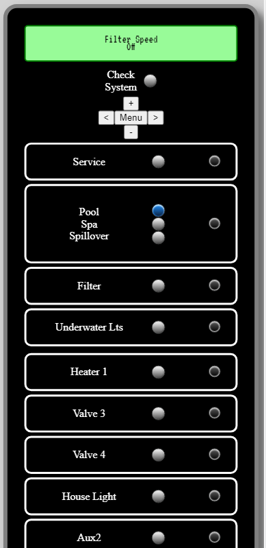
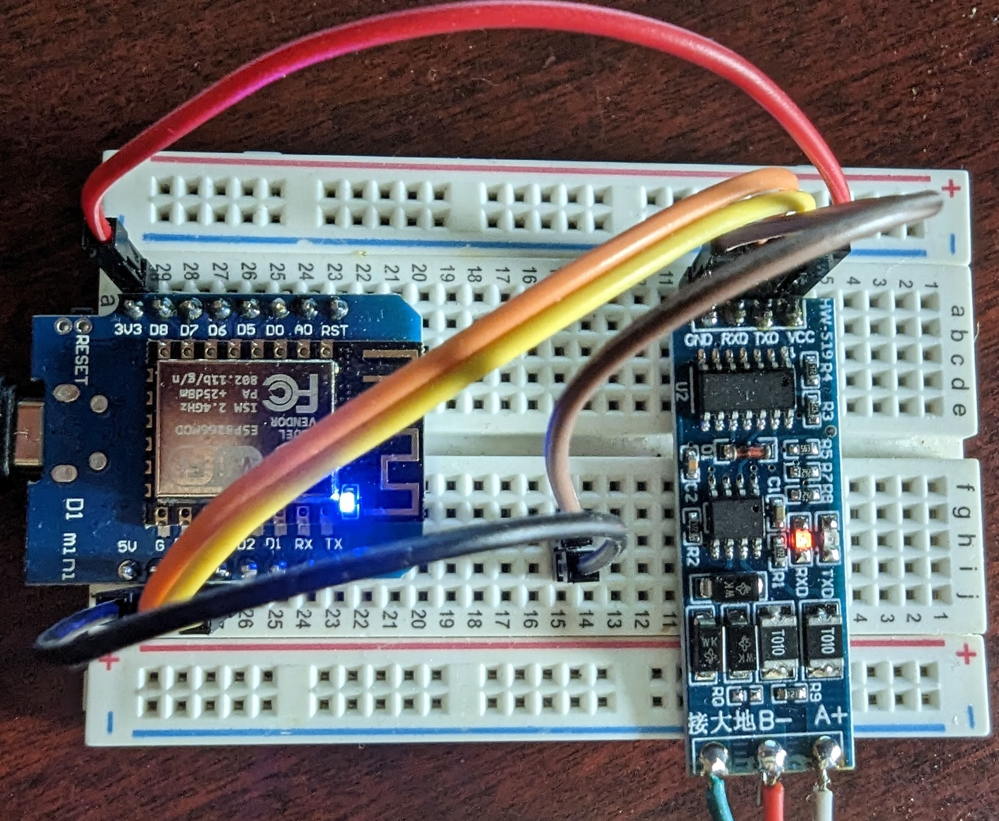
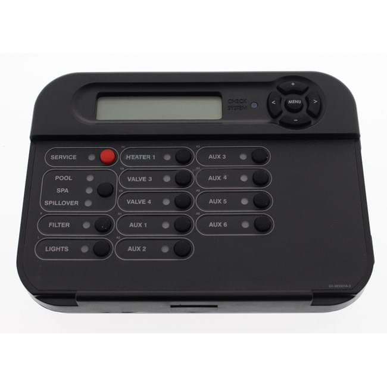
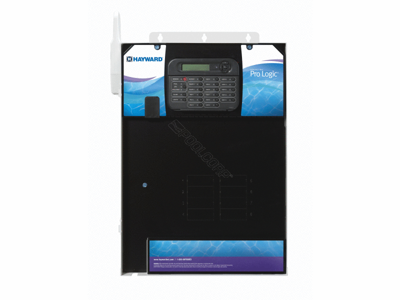
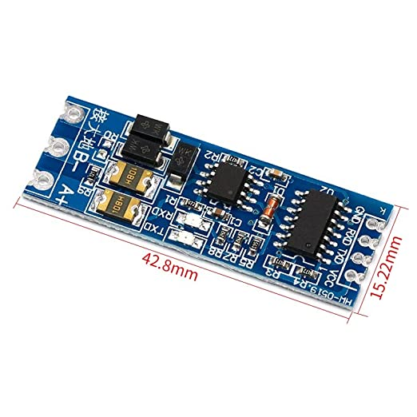

# Hayward ProLogic Pool Automation System Interface 

## aqualogic-esp8266

This project is an ESP8266 serial device designed to interface with a Hayward ProLogic pool automation system. The ESP8266 device acts as a bridge between the pool automation system's controller and a web interface, allowing users to interact with the system remotely.

The ESP8266 device utilizes a serial connection to communicate with the pool automation system's controller. It receives data in HEX format via RS485 using a TTL to RS485 module, and decodes this data for use on the web interface. The web interface is essentially a mirror of the physical controller, providing users with a familiar and intuitive way to control and monitor the pool automation system.

The main features of this project include:

<b>Web Interface:</b> The ESP8266 device hosts a web server that provides a user-friendly interface for interacting with the pool automation system. Users can access this interface through a web browser on their devices.

<b>Remote Control:</b> The web interface allows users to remotely control various aspects of the pool automation system, activating pumps, controlling lighting, and managing other system functions.

<b>Real-time Data:</b> The ESP8266 device continuously receives data from the pool automation system's controller and updates the web interface in real-time. This ensures that users have up-to-date information about the system's status and can make informed decisions.

With this ESP8266 serial device, users can conveniently manage and monitor their Hayward ProLogic pool automation system from anywhere, using a web interface that closely resembles the physical controller.

## Features

- Remote control and monitoring of the Hayward ProLogic pool automation system.
- Real-time data updates for accurate system status information.
- Intuitive web interface mirroring the physical controller's functionality.
- HEX data decoding for seamless integration with the web interface.

## Future Updates

- Captive Portal WIFI setup
- Interactive setting page to set varibles via web interface (EEPROM)
- Quick view page to see all messages on one page (Past values)

 
 

